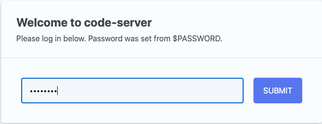
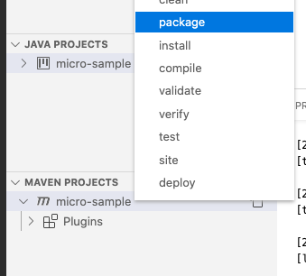

[](https://github.com/humbertodias/payara-ide/actions/workflows/docker.yml)

Online Visual code  IDE configured with payara tools extension, ready for development.

## Micro Project

    make template

## Run

	PORT=9000 docker compose up -d

For MacOS

Adding local directory as a possible volume path

```shell
SETTINGS=~/Library/Group\ Containers/group.com.docker/settings.json
ADDING_PWD_DIRECTORY=".filesharingDirectories |= . + [\"$(PWD)\"]"
jq $ADDING_PWD_DIRECTORY $SETTINGS > /tmp/modified.json
cp /tmp/modified.json $SETTINGS
```

Then

http://localhost:9090/?folder=/opt/projects/micro-sample

Password is *password*






## Ref

* [code-server](https://hub.docker.com/r/linuxserver/code-server)

* [payara-micro-vscode-tooling](https://blog.payara.fish/payara-micro-vscode-tooling)

* [fixing-the-var-folders-error-in-docker-for-mac](https://medium.com/effy-tech/fixing-the-var-folders-error-in-docker-for-mac-v2-2-3-2a40e776132d)
