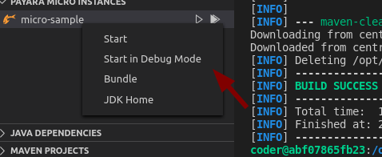
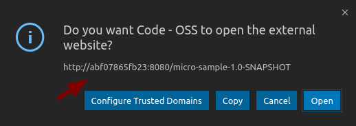
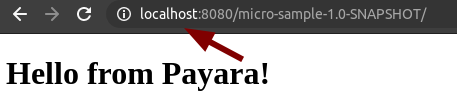
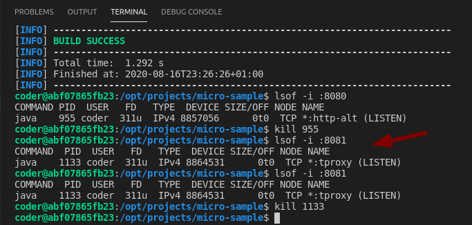

Online Visual code  IDE configured with payara tools extension, ready for development.

## Run

	PORT=9000 docker-compose up -d
    
 ## Micro Template

    echo Y | \
    mvn archetype:generate -DarchetypeGroupId=fish.payara.maven.archetypes -DarchetypeArtifactId=payara-micro-maven-archetype -DarchetypeVersion=1.0.1 -DgroupId=fish.payara.micro -DartifactId=micro-sample -Dversion=1.0-SNAPSHOT -Dpackage=fish.payara.micro.sample -Darchetype.interactive=false \
    -DoutputDirectory=./projects

Then

http://0.0.0.0:9090/?folder=/opt/projects/micro-sample

## Ref

* https://hub.docker.com/r/linuxserver/code-server
* https://blog.payara.fish/payara-micro-vscode-tooling